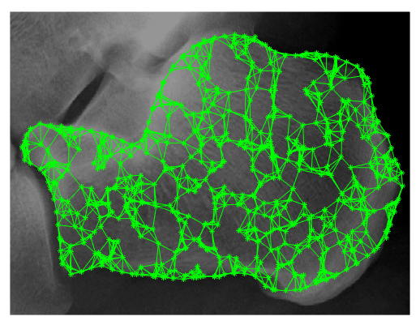
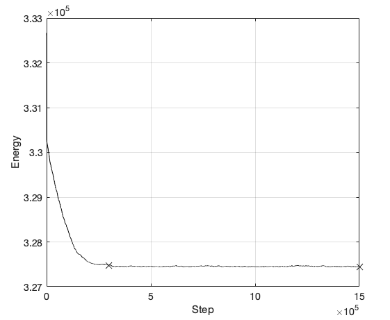

# SBS - Spongy bone simulation
This repository contains Matlab simulation used in my thesis.

The process of the spongy bone remodelling is crucial for the proper functioning of an organism, including the maintenance of homeostasis. The process can be modelled using technology (examples of which include the Monte Carlo method).

Although the algorithm in its current form requires further adjustments, it can be used for creating a tool that would make predicting the structure of a spongy bone possible, which may have possible applications in the endoprosthesis.

## Usage
Simulation was created using Matlab R2017a. You can run it using `start.m` file.

The result contains variable contains, among others, positions of points and values of energy. 

Simulation results in a network of points with minimal potential energy:

The energy is changed between simulation states and its time series can look like this:

## Appreciation
I sincerely appreciate the help of thesis supervisor, his advice and time spent reading my work.
